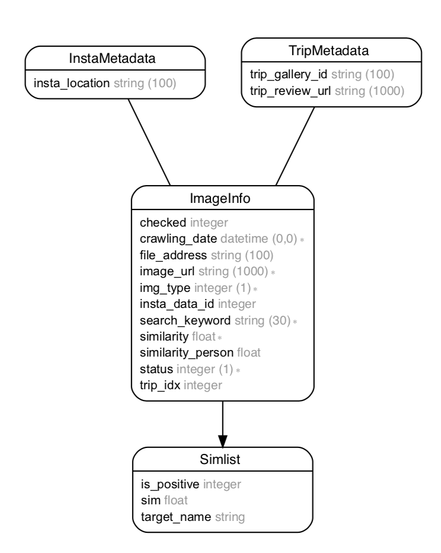

# 이미지 유사도 측정을 통한 이미지 전처리 

1.  를 이용하여 레퍼런스 이미지와 크롤링한 데이터의 이미지간의 유사도를 검사한다.

2. 데이터 베이스 테이블 상에 기록 - ver_1에서는 image_info 테이블의 similarity 컬럼에 기록

   * 런타임 에서의 성능 이슈
     * 한번에 이미지를 하나밖에 검사를 하지 않았던 이슈가 있었음
     * 프로젝트 마감 기한까지 모든 이미지 유사도를 한번씩 검사하기가 촉박

3.  앞선 2.에서의 성능 이슈가 해결 되면서 여러번 유사도 검사가 가능해짐

   * 수기 전처리 보다 여러 레퍼런스 이미지 / 긍정 부정 / 을 이용해서 검사기를 돌리는게 낫다는 판단

   * 따라서 ver_2에서는 image_info 테이블과 1:n으로 simlist  테이블을 따로 만들어서 유사도 리스트를 기준으로 판정함

    

### 1 image_downloader.py
<pre><code>이미지를 다운받는 코드</code></pre>
### 2 image_validator.py
<pre><code>DB에서 정보를 받아와서 이미지 유사도를 평가하는 코드</code></pre>
